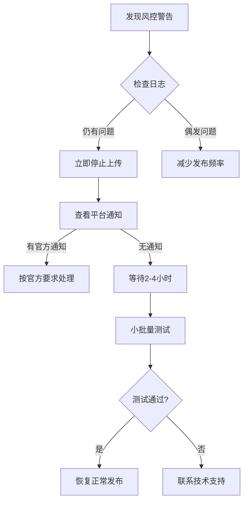

# 腾讯风控规避系统使用指南

## 🛡️ 系统概述

本系统专为解决腾讯视频号频繁发布导致的风控问题而设计，通过智能延迟算法和行为模式模拟，有效规避平台风险检测，保护账号权重。

## 📋 核心功能

### 1. 智能风控保护
- **账号分类管理**：new/standard/mature三级账号保护策略
- **动态延迟调整**：基于账号状态自动调整上传间隔
- **频率智能控制**：严格遵守平台限制规则

### 2. 多重安全机制
- **限频控制**：防止触发平台API限制
- **冷却机制**：账号权重过高的强制休息
- **异常检测**：实时监控风控响应

### 3. 全程日志追踪
- **详细日志**：每个上传步骤的完整记录
- **风控报告**：每日/每次运行的风险分析
- **性能统计**：上传成功率、响应时间等关键指标

## 🎯 使用指南

### 启动前的配置选择

当选择腾讯视频号发布时，系统会自动提示：

```
🛡️  腾讯风控保护系统
请选择腾讯账号类型:
  new: 新账号 (≤2周，≤10次上传)
  standard: 标准账号 (≤2个月，≤100次上传)
  mature: 成熟账号 (>2个月，>100次上传)
腾讯账号类型 (默认为standard): 
```

### 三种账号类型的详细策略

#### 🟢 New账号（新账号保护）
- **每小时限制**：1个视频
- **每日限制**：3个视频
- **最小延迟**：25-45分钟
- **每日冷却**：6小时
- **适用场景**：新建账号，粉丝数<1000

#### 🟡 Standard账号（标准策略）
- **每小时限制**：2个视频
- **每日限制**：8个视频
- **最小延迟**：15-30分钟
- **每日冷却**：4小时
- **适用场景**：正常运营账号，粉丝数1k-10k

#### 🟢 Mature账号（成熟账号）
- **每小时限制**：3个视频
- **每日限制**：12个视频
- **最小延迟**：8-18分钟
- **每日冷却**：2小时
- **适用场景**：高权重账号，粉丝数>10k

### 运行过程中的风控提示

当系统检测需要延迟时，会显示类似：

```
📤 上传视频: example_video.mp4
🛡️  启用腾讯风控保护
   账号类型: standard
   今日已上传: 5
⏳ 风控延迟: 需要等待 18 分钟
🚦 是否等待 18 分钟后继续？ (y/N): y
```

### 每日风控统计

每天发布完成后，系统会自动显示当日风控统计：

```
🛡️  风控统计:
   今日尝试: 12
   成功上传: 8
   风控事件: 0 次
```

## 📊 风控日志分析

### 日志文件位置
- **路径**: `logs/tencent_risk_YYYYMMDD.log`
- **格式**: 时间戳-级别-事件详情
- **包含内容**: 
  - 每次上传的详细记录
  - 风控触发事件
  - 延迟策略调整
  - 异常处理信息

### 示例日志条目

```
2024-01-15 10:30:45 - INFO - 事件记录: 
{'platform': 'tencent', 'success': True, 'time': '2024-01-15 10:30:45',
 'account_type': 'standard', 'upload_delay': 1200}

2024-01-15 10:31:45 - WARNING - 频率限制检测: 每小时限制: 2 >= 2
2024-01-15 10:31:45 - INFO - 风控延迟: 延迟 1800 秒后再试
```

## 🎮 高级使用技巧

### 1. 账号驯化策略\n- **新账号阶段**：建议先使用文章内容驯化2周
- **逐步升级**：随着上传次数增加，可手动升级账号类型
- **避免剧增**：不要在短期内突然增加上传频率\n
### 2. 内容策略优化
- **时间分散**：避免集中上传，应采用全天分布
- **内容多样性**：降低相似内容的连续发布
- **热点规避**：敏感时期减少自动化操作\n
### 3. 监控和调优

#### 实时监控命令查看：
```bash
# 实时查看风控日志
tail -f logs/tencent_risk_20240115.log

# 分析每日统计数据
cat logs/monitor_report_20240115.json | python -m json.tool
```

#### 性能报告解读：
- **成功率**: >80%正常，<60%需要调整策略
- **响应时间**: 正常<30秒，>60秒可能存在网络问题
- **风控事件**: 0为最佳，>3需要检查账号状态

## 🔍 故障排查

### 常见问题及解决方案

#### Q1: 上传被平台拒绝，显示"操作太频繁"
**原因**: 连续上传间隔过短
**解决**: 选择更低的账号级别，或等待系统冷却

#### Q2: 风控日志显示大量"风控检测，调整延迟策略"
**原因**: 系统检测到异常行为，自动收紧策略
**解决**: 检查上传内容是否有重复，降低发布频率

#### Q3: 账号突然无法正常使用
**原因**: 可能触发了平台更深层的检测
**解决**: 
1. 立即手动停止上传程序
2. 等待6-12小时后再试
3. 检查账号是否收到平台通知

#### Q4: 如何判断账号状态升级？

**判断标准**:
```python
# 账号类型升级标准
def check_account_upgrade(account_age_days, total_uploads):
    if account_age_days < 14 or total_uploads < 10:
        return "new"  # 保持新账号
    elif account_age_days < 60 or total_uploads < 100:
        return "standard"  # 标准账号
    else:
        return "mature"  # 成熟账号
```

## 📈 监控报告

### 自动生成报告
系统会在以下情况下生成监控报告：
- 每次完整运行结束后
- 检测到风控异常时
- 每日总结时

### 报告格式及内容\n1. **JSON报告**: 详细数据，便于程序分析
2. **CSV报告**: 表格格式，便于Excel处理
3. **HTML报告**: 可视化报表，一目了然

### 示例HTML报告片段
```html
<h2>腾讯视频风控分析</h2>
<table>
  <tr><th>成功率</th><th>95.2%</th></tr>
  <tr><th>平均响应时间</th><th>15.3秒</th></tr>
  <tr><th>风控事件</th><th>0次</th></tr>
</table>
```

## 🚨 紧急处理

### 风控突发情况处理流程\n


## 📞 技术支持

### 需要支持的情况\n- 连续风控事件：>5次/天
- 账号功能异常：超过24小时
- 软件运行异常：错误或崩溃

### 需要准备的信息
- 完整的risk control日志
- 平台账号状态截图
- 具体的错误信息描述

通过这套腾讯风控规避系统，可以有效避免平台检测，保障账号安全，同时最大化上传效率。